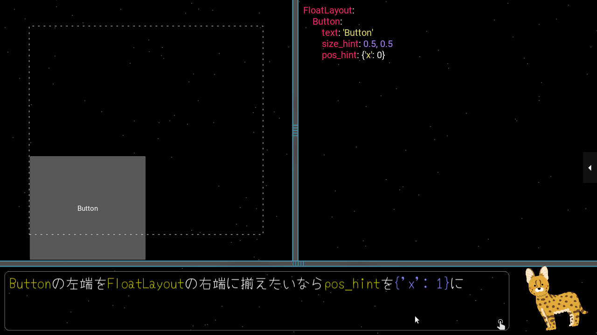

# Kivy Tutorial

KivyのtutorialをKivyで作る試み

[YouTube](https://www.youtube.com/playlist?list=PLNdhqAjzeEGj1W7ws6OBI-SxUsQVRlN2x)

## Test環境

- CPython 3.7.1
- Kivy v2.0.0rc1, ede9bd1b806619dda022ab438964ce1b48645521, 20200320

## TODO

- triohelper.animateを削除

## Support

興味のある方は開発を支援してくれると助かります。この[E-mail address](mailto:flow4re2c@gmail.com)宛にPayPalでお金を送るか、Amazonのギフトcodeを送ってください。
